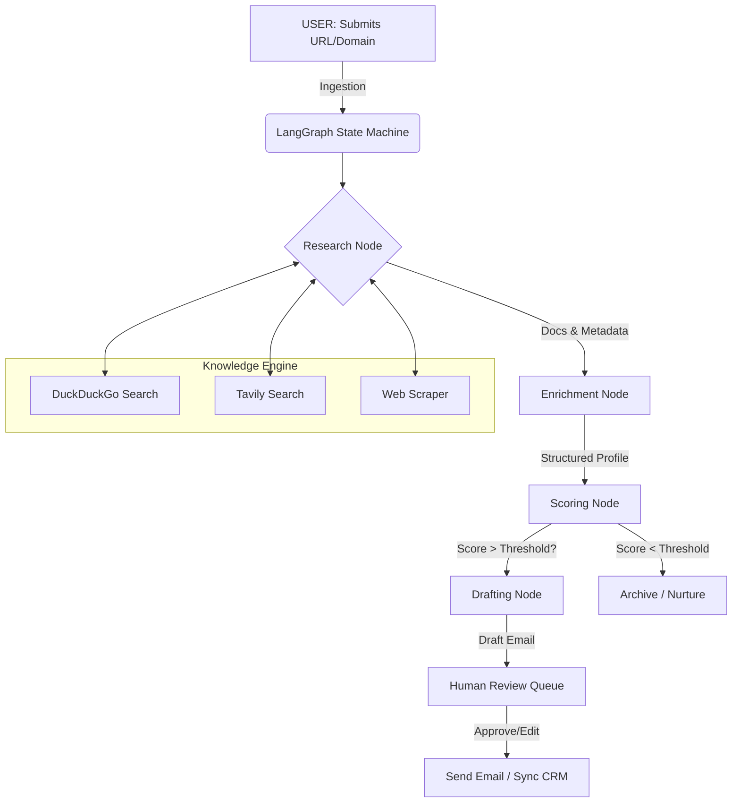

# 🧠 NexusAI: The Autonomous Sales Engineer

<div align="center">


<br/>

**Automate the tedious 80% of your sales process.**<br/>
NexusAI is an intelligent CRM agent that autonomously researches leads, scores them with verifiable logic, and drafts hyper-personalized cold outreach that actually converts.

[View Demo](#) · [Report Bug](https://github.com/yourusername/nexusai/issues) · [Request Feature](https://github.com/yourusername/nexusai/issues)

</div>

---

## 🚀 Why NexusAI?

The modern sales stack is broken. SDRs spend hours switching between LinkedIn, company websites, and news outlets just to write one "personalized" email that often gets ignored.

**NexusAI fixes this by treating lead qualification as an engineering problem.**

Instead of generic templates, NexusAI builds a **structured knowledge graph** for every company in your pipeline. It "reads" their website, analyzes their tech stack, finds their funding status, and identifies key decision-makers—all before you even look at the lead.

### ✨ Core Capabilities

- **🕵️ Autonomous Deep Research**:
  - Scrapes company websites and structured metadata.
  - Cross-references data with **DuckDuckGo** and **Tavily** for real-time verification.
  - Extracts key signals: Funding rounds, Recent Hires, Tech Stack, and strategic shifts.

- **🧠 Cognitive Lead Scoring (0-100)**:
  - Uses **Llama 3.3 (via Groq)** to analyze verified data against your Ideal Customer Profile (ICP).
  - Provides a **score confidence** metric and a human-readable **reasoning** for every score.
  - Detects **Buying Signals** (e.g., "Hiring 3 backend engineers") vs. **Red Flags**.

- **✍️ Hyper-Personalized Drafting**:
  - Generates emails that *prove* research was done.
  - References specific pain points, recent news, or technical challenges found during research.
  - **No Templates**: Every email is uniquely generated based on the company's specific context.

- **📊 Modern Glassmorphism Dashboard**:
  - Built with **Next.js 16** and **Tailwind v4**.
  - Real-time pipeline analytics, drag-and-drop Kanban (coming soon), and detailed lead views.
  - Dark mode first design with premium animations (Framer Motion).

---

## 🏗️ Architecture

NexusAI uses a sophisticated **LangGraph** workflow to manage the cognitive state of the agent.



---

## 🛠️ Tech Stack

### Backend (The Brain)
- **Framework**: FastAPI (High-performance async Python API)
- **Orchestration**: LangChain & LangGraph (Stateful multi-actor (agent) applications)
- **LLM Engine**: Groq (Llama 3.3 70B) for lightning-fast inference
- **Database**: SQLAlchemy (Async) with SQLite (Dev) / PostgreSQL (Prod)
- **Data Validation**: Pydantic v2

### Frontend (The Face)
- **Framework**: Next.js 16 (App Router)
- **Styling**: Tailwind CSS v4, Framer Motion (Animations), Lucide React (Icons)
- **Components**: Shadcn/ui (Radix UI primitives)
- **Auth**: Clerk (Secure authentication)
- **State Management**: SWR (Stale-while-revalidate data fetching)

---

## ⚡ Getting Started

### Prerequisites
- **Python 3.11+**
- **Node.js 18+**
- **Groq API Key** (Essential for LLM inference)

### 1. Clone the Repository
```bash
git clone https://github.com/your-username/nexusai.git
cd nexusai
```

### 2. Backend Setup
The backend handles all AI logic, database connections, and API endpoints.

```bash
cd backend

# Create virtual environment
python -m venv .venv

# Activate (Windows)
.venv\Scripts\activate
# Activate (Mac/Linux)
# source .venv/bin/activate

# Install dependencies
pip install -r requirements.txt

# Setup Environment
# Create a .env file based on the example below
```

**`backend/.env` Configuration:**
```ini
GROQ_API_KEY=gsk_your_key_here
TAVILY_API_KEY=tvly_your_key_here  # Optional but recommended for better research
DATABASE_URL=sqlite:///./nexusai.db
```

**Run the Backend:**
```bash
python main.py
# Server will start on http://localhost:8000
# API Docs available at http://localhost:8000/docs
```

### 3. Frontend Setup
The frontend is a modern Next.js dashboard.

```bash
# Open a new terminal
cd frontend

# Install dependencies
npm install

# Setup Environment
# Create a .env.local file
```

**`frontend/.env.local` Configuration:**
```ini
NEXT_PUBLIC_CLERK_PUBLISHABLE_KEY=pk_test_...
CLERK_SECRET_KEY=sk_test_...
NEXT_PUBLIC_API_URL=http://localhost:8000
```

**Run the Frontend:**
```bash
npm run dev
# Dashboard will start on http://localhost:3000
```

---

## 📖 Usage Guide

1.  **Sign In**: Use the Clerk-powered authentication to log in.
2.  **Add a Lead**: Navigate to "Leads" and click "Add Lead". Enter a company domain (e.g., `stripe.com`).
3.  **Watch the Magic**:
    - The agent will start the **Research** phase.
    - Status will update from `researching` -> `scoring` -> `drafting`.
4.  **Review**:
    - Click on the lead to see the **Intelligence Report** (Tech stack, funding, etc.).
    - Review the **Drafted Email**.
    - Edit if necessary, or approve for sending.

---

## 🤝 Contributing

We welcome contributions! Please see our [CONTRIBUTING.md](CONTRIBUTING.md) for details on how to submit pull requests, report issues, and request features.

1.  Fork the Project
2.  Create your Feature Branch (`git checkout -b feature/AmazingFeature`)
3.  Commit your Changes (`git commit -m 'Add some AmazingFeature'`)
4.  Push to the Branch (`git push origin feature/AmazingFeature`)
5.  Open a Pull Request

---

## 📄 License

Distributed under the MIT License. See `LICENSE` for more information.

---

<div align="center">
  <p>Built with ❤️ by the NexusAI Team</p>
</div>
